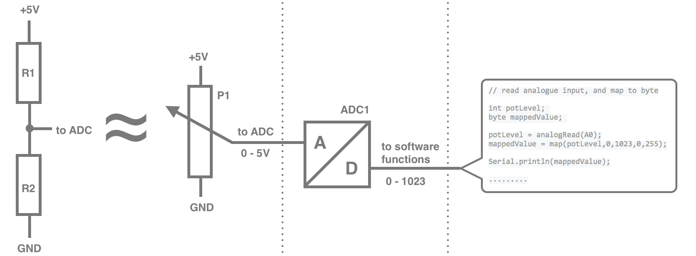
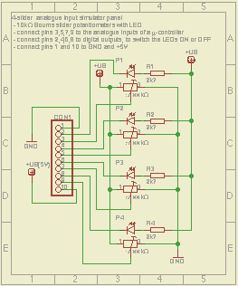

# **LabTools** : Analogue input slider panel

## What

This slider panel is part of a homemade toolset of modules to simplify the r&d phase of my µ-controller projects. It consists of four [linear slider potentiometers](pdf-files/Bourns-slider-potentiometer-datasheet.pdf), which are connected as [voltage dividers](https://en.wikipedia.org/wiki/Voltage_divider). Built with the component values as stated in the bill-of-materials, the panel is optimized for 0 to 5V ADC's. Thanks to its universal layout, the module can easily be adapted for other voltage ranges, by changing the resistor values.

[](images/Slider-panel-topview.png)

## Why

Whilst playing around with µ-controllers and their peripherals, I got often confronted with the need for analogue values for various reasons.
 - When designing a [ternary clock](https://github.com/nostradomus/Base3-clock) I had a need to mix my own cool colors to display with the RGB LED's in this project. The slider panel was just what I needed, as I could easily simulate the three color channels red, green and blue, plus the brightness on the fourth slider.
 - Next on a rainy Sunday, we decided to have some fun, and build our version of the [cool O++O robot](https://github.com/OttoDIY/OttoDIY). This cute little guy is running, or rather, dancing on four servos. In a project with *constrainted* movements, it is interesting to test the mechanical limits of your rotations before breaking any of your nice 3D-printed parts. YAGA ! **Yet another great application** for the slider panel.
 - When working with servos, not only the angular limits are important, but for several applications also the center point of the circular movement. This came in handy for a robot arm project based on radial coordinates.  
 - A completely different, but obvious example, was application testing. For practical reasons, most of the time, it is preferable to replace physical sensors by **controlled** test values. In pure programming these usually originate from test units. With this type of methodology however, it is utmost impossible to do exhaustive testing. Especially when combining multiple analogue values. For that matter, as an extra test, the slider panel has proven to be very handy.  
 - And their will probably be dozens of other useful applications for this little lab tool...

## How

Simple projects don't need complicated specifications. However once you start, there's always a couple of nice-to-haves you just have to go for.
 - The [slider potentiometers](pdf-files/Bourns-slider-potentiometer-datasheet.pdf) should  
    - have a reasonable travel length for precision
    - have a linear taper
    - have a center detent
    - exist in different resistance values (10kΩ and higher)
    - have a built-in indicator LED
 - The [housing](#mechanical-construction) should have
    - an ID for each slider
    - labels for each pin on the interface connector
 - And the whole thing must be **fancy** :sunglasses: !

## Progress status

 - [x] having a [need](#why)
 - [x] define the [functional specifications](#how)
 - [x] design the final [electronics](#electronics)
 - [x] build a proof-of-concept for the final [electronics](#electronics)
 - [x] write [code for the µ-controller](#µ-controller-code) respecting best-practices
 - [x] design and build a [state-of-the-art housing](#mechanical-construction)
 - [ ] validate the [application examples](#µ-controller-code) with in-line documentation 

## Technical details

### The voltage divider, the ADC and the mapping function

The whole setup of this mini-project is based on three crucial denominators, two in the electronics, and one in software.



The first part of the magic happens inside the potentiometer which is connected as a [voltage divider](https://en.wikipedia.org/wiki/Voltage_divider). Some current will flow from +5V to ground through the 10kΩ resistor. The third wire (or center tap) of the potentiometer gives us a variable connection on that 10kΩ range, which actually splits it into two resistors (which add up to be the full resistance). In such a passive resistive-only circuit, the center tap will output a voltage which is proportional to the total potential, the same way as the fractions of the two resistors are to the total resistance. Next, as the [chosen slider potentiometer](pdf-files/Bourns-slider-potentiometer-datasheet.pdf) is of good linear quality, the output will even be equally proportional to the slider's position on the total slider travel length.  

The second step is where the µ-controller will convert this (physical) voltage in a software readable value. This is called an [ADC, or analogue-to-digital converter](https://en.wikipedia.org/wiki/Analog-to-digital_converter). They exist in numerous varieties of architectures, conversion types, speeds, precision... For the below examples, I will use the [ATmega328p](pdf-files/datasheet-ATmega328P.pdf)'s built-in ADC's. They are marked as A0, A1, A2... Being of 10-bit precision, the conversion of the 0 to 5V voltage will give a value between 0 and 1023. More details on this specific ADC can be found from [page 237 to 248 in the µ-controller's datasheet](pdf-files/datasheet-ATmega328P.pdf).

The last trick to be done is converting the 0 to 1023 value to the range for our application. In below examples, colors and PWM outputs need to be set. All of these need byte-values. For PWM 0 to 255, and for RGB-colors (0..255,0..255,0..255). You could of course write some simple equations to apply the rule of three. However the C-language in the [Arduino IDE](https://www.arduino.cc/en/Main/Software) is having a very handy function for that, called [mapping](https://www.arduino.cc/en/reference/map).
```C
recalculated_value = map(value, fromLow, fromHigh, toLow, toHigh);
// example : x = map(511,0,1023,0,255)
//           -> gives x = 127
```
### The Electronics

#### The Schematic

The electronics setup is straightforward and easy to understand. Four [variable resistors P1 to P4 (linear sliders), or potentiometers](pdf-files/Bourns-slider-potentiometer-datasheet.pdf) are connected between +5V and ground. Depending on the position, the slider-pin will output a voltage between 0 and 5V. This can be directly connected to your µ-controller's analogue input, or ADC. The (optional) LED's in the slider button have been fit with 2,7kΩ resistors (R1 to R4), to limit the current flowing through, and to not make you blind :sunglasses:. For connector CON1, a **90° bent** 10x1 pin-header is preferred, for easy access in combination with the laser-cut housing.

[](images/Slider-panel-schematic.png)

#### The PCB

The PCB has been designed single-sided with wide traces for "kitchen-brew" production. The larger pcb size and generous spacing between the [potentiometers](pdf-files/Bourns-slider-potentiometer-datasheet.pdf) is mainly for ergonomical reasons. Be precise when drilling the holes in the pcb, as the quality of the mechanical construction depends on correct positioning of the potentiometers and the four mounting holes.

[](images/Slider-panel-pcb.png)

#### Connection with a µ-controller board

The board has been designed with a 10-way (90° bent) pin-header for easy connection with standard Dupont lines, typically used for testing during breadboard phase.

:electric_plug:|name |description
---------------|-----|----------------------------------
1              |GND  | ground
2              |LED1 | indicator led on potentiometer 1
3              |P1   | variable output on potentiometer 1
4              |LED2 | indicator led on potentiometer 2
5              |P2   | variable output on potentiometer 2
6              |LED3 | indicator led on potentiometer 3
7              |P3   | variable output on potentiometer 3
8              |LED4 | indicator led on potentiometer 4
9              |P4   | variable output on potentiometer 4
10             |+5V  | 5 volt power Connection

In a minimum setup, pins 1 and 10 (power and ground), and at least one Px output need to be connected. When using an Arduino eco-system, the potentiometer's variable output can be connected directly to any of the µ-controller's analogue inputs which accept 0 to 5V. The *optional* led connections can either be connected directly to the ground (always ON), or to a digital output of the µ-controller (capable of sinking at least 10mA). When building the full project (lasercut plexi included), you will see the connection descriptors engraved in the rear-panel, just above the pin-header.

[](images/Slider-panel-interface.png)

### µ-Controller code

The demo/test software has been written in the free [Arduino IDE](https://www.arduino.cc/en/Main/Software), or as [sourcecode](https://github.com/arduino/Arduino/).
These examples are using the [servo library](https://www.arduino.cc/en/Reference/Servo), which is included in the Arduino IDE software, and [Adafruit's Neopixel library](https://github.com/adafruit/Adafruit_NeoPixel). All sketches can be found in the [source-folder](source/).

#### Application example 1 : Robot-arm servo calibration

A basic [servo calibration application](source/robotarm-servo-calibration.ino) is available in the [source-folder](source/). The Arduino sketch contains extensive comments on how to connect and run the application. The basic idea is to first find the clockwise :leftwards_arrow_with_hook: and counterclockwise :arrow_right_hook: limits of a servo inside your mechanical construction. Secondly, in many construction you might also be interested in the mid-point between these to limits. And, this is not necessarily CW :leftwards_arrow_with_hook: plus CCW :arrow_right_hook: divided by two ! Next, in the serial monitor, you can read the settings to be used in your future application. By using the CW :leftwards_arrow_with_hook: and CCW :arrow_right_hook: limits as parameters 4 and 5 in the mapping function, you can easily prevent mechanical overshoot (and damage) while fine-tuning your mechanics. Before connecting your mechanical construction, it be a good idea to set the slider potentiometers at 50%, and to position your servos about half-way of their possible movement. When starting the application, the serial monitor will provide connection and setup info. Next, the software will slowly move the servos to the position as preset by the potentiometers. Once the sketch reaches the main-loop, things will be more reactive. So, handle with care :collision: :exclamation:

#### Application example 2 : RGB LED color mixer

A basic [color mixer application](source/RGB-LED-color-mixer.ino) is available in the [source-folder](source/). The Arduino sketch contains extensive comments on how to connect and run the application. The basic idea is to brew your own color by mixing R(ed), G(reen) and B(lue) until you like the result visually. Next, in the serial monitor, you can read the settings to be used in your future application (0..255,0..255,0..255). Slider number 4 will let you play with the overall brightness, and provide feedback in the serial monitor accordingly. When starting the application, the serial monitor will provide connection and setup info, followed by a short LED test.

### Mechanical construction

The housing consists of two layers of lasercut and engraved plexi plates. I would suggest to use 3mm of thickness. When using another thickness, pay attention to adapt the length of screws and bolts.

[](images/Slider-panel-frontview.png)

Material :
 - 4 nylon bolts, M3 x 8
 - 8 nylon nuts, M3
 - 8 metal screws, M2 x 4 (optionally with conic head)

The four nylon bolts fit in the four holes of the rear plexi plate. The heads should be down, as they will serve as feet for the module. The rear panel has to be turned, in a way that the connector info (GND-P1-L1-P2...) is readable on the top. Next four nylon bolts are fit on the threading (which points up). These standard bolts are thick enough to serve as spacers for the PCB, which has to be fit on top. The other four nylon bolts will be used to fix the PCB. The front plate (with 1-2-3-4 on top) is fixed on the metal slider housings with the 8 metal screws. The prototype has been built with standard flat-head screws. The 3mm plexi is however thick enough to be adapted for screws with a conic head (extra milling required).

## Contributors

If you are having any good suggestions, just drop me a line [:email:](http://nostradomus.ddns.net/contactform.html).
If feasible, I'll be happy to implement proposed improvements.
And if you are having lots of time, I'll be happy to share the work with you ;-).

When you create your own version, don't forget to send us some nice pictures of your construction. We'll be happy to publish them in the :confetti_ball:Hall of Fame:confetti_ball:.

## :globe_with_meridians: License

There is no specific license attached to this project for personal use.

If you like it, have fun with it (at your own risk of course :-D), and especially, be creative.

Oh, and when using anything from this repository, it is highly appreciated if you mention its origin.

If you would like to use any of my work (or the whole project) for commercial use, just [contact me :email:](http://nostradomus.ddns.net/contactform.html), so we can add the appropriate license, which best fits your business.
